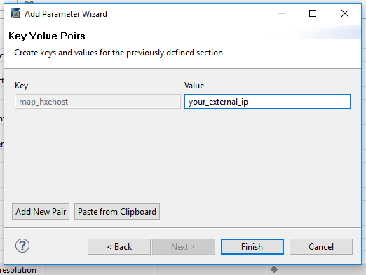
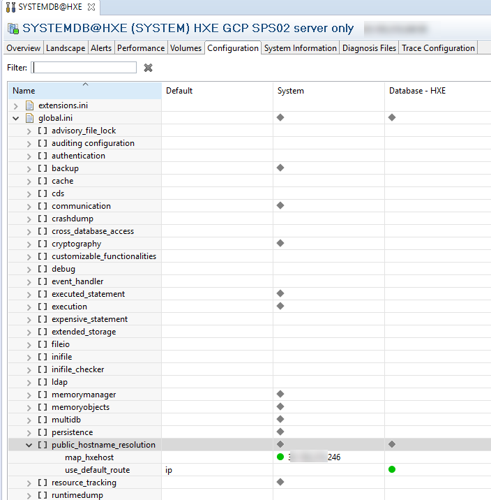

## Prerequisites  
 - [Create a HANA Express instance using the Google Cloud Launcher](https://www.sap.com/developer/tutorials/hxe-gcp-getting-started-launcher.html)
 - [Download and install Eclipse](https://www.sap.com/developer/how-tos/2016/09/hxe-howto-eclipse.html)

## Next Steps
 - [View all How-Tos](http://www.sap.com/developer/tutorial-navigator.how-to.html)

## How-To Details
Provides instructions to complete the necessary configuration to connect to a tenant database from SAP HANA Studio. The tenant database was created in an SAP HANA, express edition, in the Google Cloud Platform.

### Time to Complete
**15 Min**.

---

[ACCORDION-BEGIN [Step 1: ](Open the Administration cockpit)]

Using a user with the proper permissions, such as SYSTEM, open the Administration cockpit by selecting the connection to SYSTEMDB and clicking on the **Administration** button.

Click on the **Configuration** tab and use the value `use_default_route` as a filter:

[ACCORDION-END]

[ACCORDION-BEGIN [Step 2: ](Add a new key-value pair)]

Right-click on `public hostname resolution` and on **Add parameter**. Use `map_hxehost` as the key and your external IP as shown in the Compute Engine as the value.

Click on **Finish**.

This is what `public_hostname_resolution` should look like:

[ACCORDION-END]

[ACCORDION-BEGIN [Step 3: ](Add the connection in SAP HANA Studio)]
You can now proceed to connect to your tenant DB as a **New System**:

[ACCORDION-END]

## Next Steps
 - [View all How-Tos](http://www.sap.com/developer/tutorial-navigator.how-to.html)
