## Prerequisites  
- **Proficiency:** Beginner
- **Development environment:** Apple iMac, MacBook or MacBook Pro running Xcode 9 or higher
- **SAP Cloud Platform SDK for iOS:** Version 2.0
- **Tutorials:** [Sign up for a free trial account on SAP Cloud Platform](https://www.sap.com/developer/tutorials/hcp-create-trial-account.html) and [Enable SAP Cloud Platform mobile service for development and operations](https://www.sap.com/developer/tutorials/fiori-ios-hcpms-setup.html)

## How-To Details
The **SAP API Business Hub** contains a catalog of API's and Business Services for SAP S/4HANA Cloud, SAP Leonardo, SuccessFactors, Hybris, Concur, and many more.

For developers, this is a tremendous help when developing applications which need to interact with one or more of these products, because behind all of these API's, a sandbox environment is available, all populated with data. During development, you don't need to interact with a live system, you just connect to the sandbox API endpoint. And once you go live, all you need to do is change the sandbox API endpoint to the productive API endpoint, and off you go.

The **SDK Assistant** tool of the **SAP Cloud Platform SDK for iOS** is an indispensable tool when creating an application based on an SAP API Business Hub API. With it's wizard-style approach to creating the scaffolding application, it helps you select the correct API endpoint, abstracts the authentication to the API Hub and generates the Xcode project containing all the proxy classes to interact with the selected API Hub OData service.

In this tutorial, you will create an application using an **SAP Hybris Marketing Cloud** API endpoint. When you have finished the tutorial, you have learnt how quickly you can create an application using the SAP Cloud Platform SDK for iOS and the SAP API Business Hub, and how little code is necessary to actually create a nice-looking, interactive working application.

For this tutorial, you will expose the **Corporate Accounts** in SAP Hybris Marketing Cloud, and display them with an SAP Fiori control which allows you to call, message or email these contacts.


### Time to Complete
**20 Min**.

---

[ACCORDION-BEGIN [Step 1: ](Configure SAP Cloud Platform SDK for iOS Assistant)]

> **Note**: If you have already configured the SAP Cloud Platform SDK for iOS Assistant, you can **skip this step** and proceed with "Step 2 - Run the SAP Cloud Platform SDK for iOS Assistant".

.

This step provides simplified steps to configure the SAP Cloud Platform SDK for iOS Assistant application using the SAP Cloud Platform mobile service for development and operations cockpit.

Log on to your SAP Cloud Platform trial account at [https://account.hanatrial.ondemand.com/](https://account.hanatrial.ondemand.com/) and once logged in, navigate to **Services**. Scroll down to **Mobile Services** and click on the **Development & Operations** tile. In the **Development & Operations - Overview** page, click the **Go to Service** link to open a new window to **SAP Cloud Platform mobile service for development and operations**.

> Alternatively, you can go directly to `https://hcpms-<your_user_id>trial.dispatcher.hanatrial.ondemand.com/`.

.

Once you're logged in to **SAP Cloud Platform mobile service for development and operations**, click the **Important Links** tab in the lower left bottom. The **Important Links** section opens:


Locate the tile **SAP Cloud Platform SDK for iOS Assistant** and click the **Importing URLs directly into Assistant** link. You should now see the following pop-up:


Click the **Open SAP Cloud Platform SDK for iOS Assistant** button. The SAP Cloud Platform SDK for iOS Assistant application will start. The **New Account** settings dialog will open, and both **Admin API URL** and **Admin UI URL** parameters are pre-populated automatically:


Provide the following additional details:

| Field | Value |
|----|----|
| Name | A descriptive name for the configuration, for instance `SAP Cloud Platform Mobile Services` |
| Authentication Type | `Basic Authentication` |
| User | Your trial account user |
| Password | Password for your trial account user |


Click **Add** when finished. The account is now added to the SDK Assistant:


Close the **Accounts** dialog.

[ACCORDION-END]

[ACCORDION-BEGIN [Step 2: ](Create an Xcode Project)]

Click the **Plus** button on the top-right of the SDK Assistant. The first page of the Xcode Project generation wizard lets you define the Project Properties.

Enter the following details:

| Field | Value |
|----|----|
| Product Name | `MyHybris` |
| Author | `<your name>` |
| Organization Name | `<your company name>` |
| Organization Identifier | `com.sap.tutorials.demoapp` |
| Destination | `<choose a local destination>` |

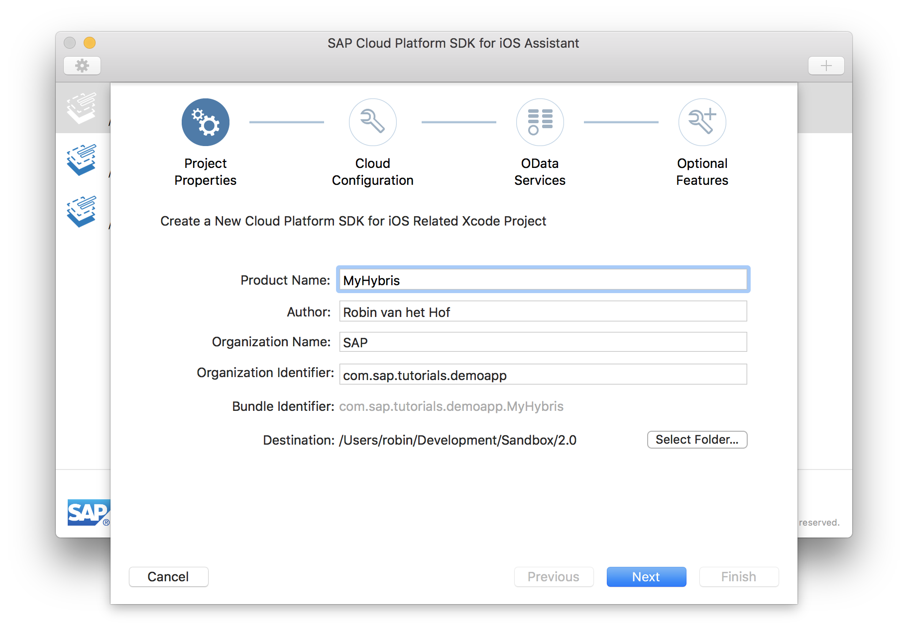

Click **Next** to advance to the **SAP Cloud Platform mobile service for development and operations Configuration** step.

[ACCORDION-END]


[ACCORDION-BEGIN [Step 3: ](SAP Cloud Platform mobile service for development and operations Configuration details)]

In the **SAP Cloud Platform mobile service for development and operations Configuration** page, select the **Create** tab button.

Enter the following details:

| Field | Value |
|----|----|
| Application Name | `MyHybris` |
| Application Identifier | `com.sap.tutorials.demoapp.MyHybris` |
| Authentication Type | `SAML Authentication` |

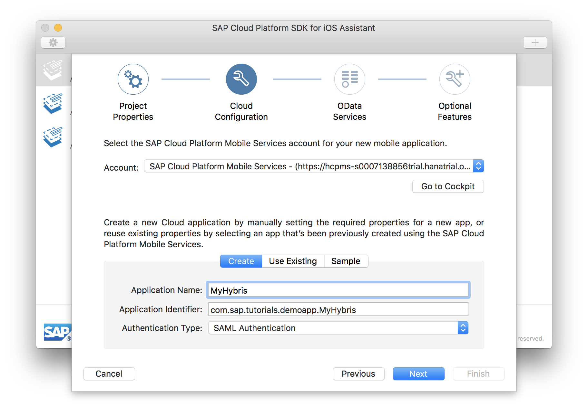

Click **Next** to advance to the **OData Services** step.

[ACCORDION-END]

[ACCORDION-BEGIN [Step 4: ](OData Services)]

In the **OData Services** page, you can define the back end connection. Here you will add the OData endpoint for the **Hybris Marketing Cloud** OData service.

Click the **Plus** button, and from the context menu, select **New Destination to a Service from the API Business Hub...**.

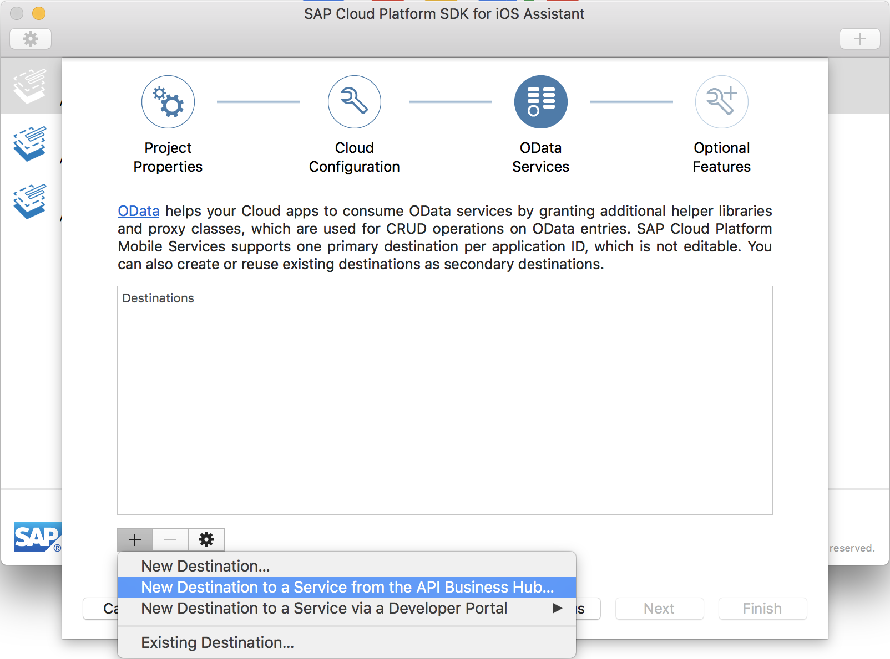

A dialog opens. In the left pane, scroll down a bit to **SAP Hybris Marketing Cloud**. In the right pane, locate the **Marketing - Corporate Accounts** entry and click the **Consume** button:

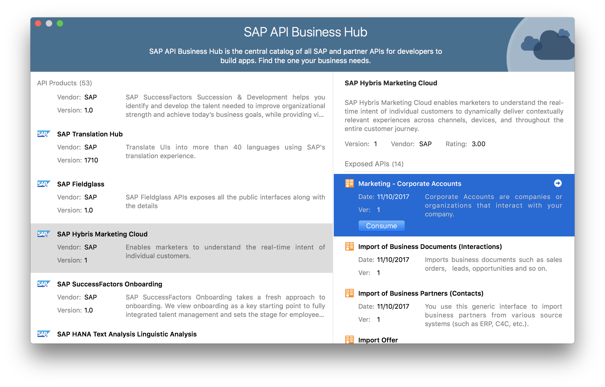

In the next page, leave the settings as-is:

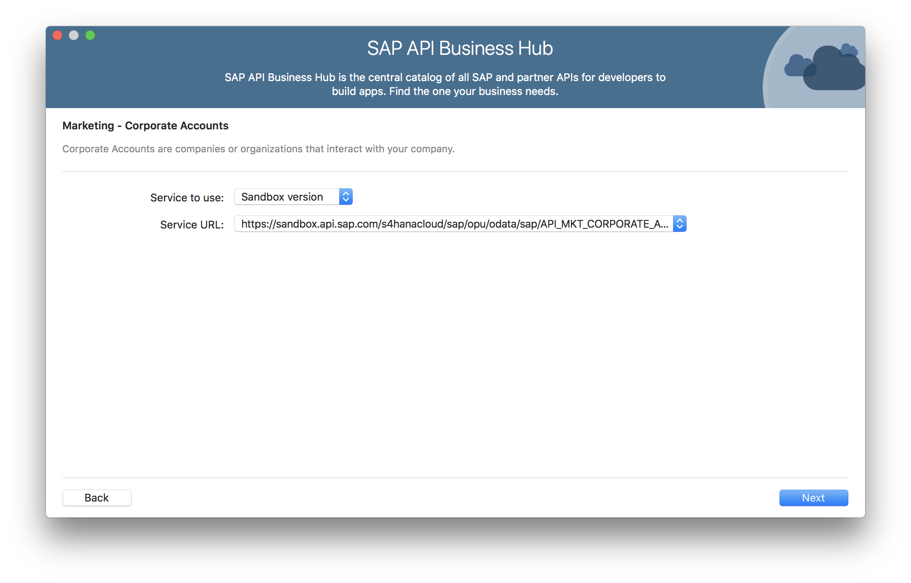

Click **Next** to proceed. The **Create New Destination** dialog now pops up. In the general tab, review the configured **Destination name** and **Back-end URL**:

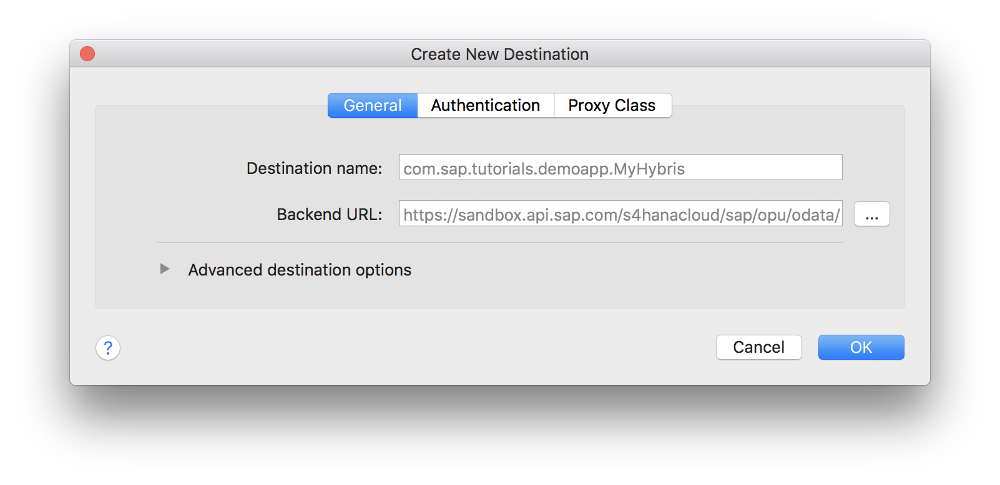

In the **Authentication** tab, note the **Authentication Type** is set to **No Authentication**:

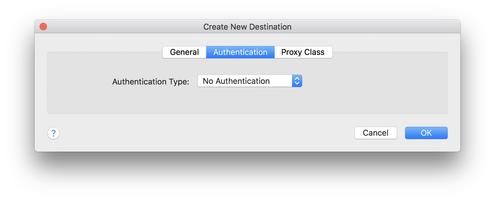

This is because SAP Cloud Platform mobile service for development and operations will add the API Business Hub `APIkey` request header to the requests, so you as a developer don't need to worry about the authentication to SAP API Business Hub.

Click **OK** to dismiss the dialog. The OData destination is now added:

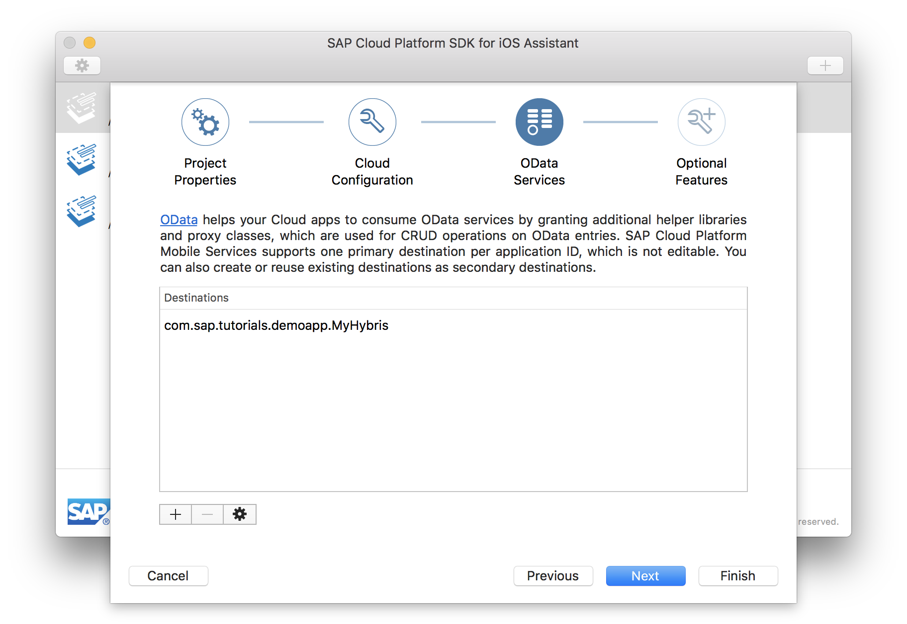

Click **Next** to advance to the **Optional Features** step.

[ACCORDION-END]

[ACCORDION-BEGIN [Step 5: ](Optional Features)]

In the **Optional Features** page, you have the option to generate a **Master-Detail Application**, enable **logging** and **log uploads**, and enable **remote notifications**.

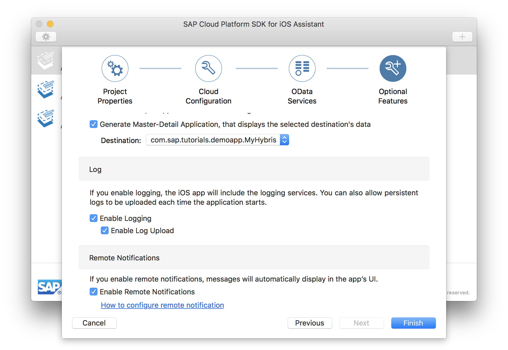

Make sure the checkboxes **Generate Master-Detail Application**, **Enable Logging** and **Enable Log Upload** are selected and click **Finish** to complete the wizard.

> Most likely the checkbox for **Remote Notifications** is disabled. This happens because no APNS endpoint is configured for the application definition in SAP Cloud Platform mobile service for development and operations. Once configured with a valid certificate, this option becomes available.


[ACCORDION-END]

[ACCORDION-BEGIN [Step 6: ](Generating the Xcode project)]

After you have clicked **Finish** in the previous step, the SDK Assistant now loads the OData service's metadata. Based on this metadata, the OData proxy classes will be generated for the Xcode project.

In addition, the configuration settings you have provided in the SDK Assistant are now being sent to SAP Cloud Platform mobile service for development and operations.

> **NB:** If you have already 3 native applications defined in SAP Cloud Platform mobile service for development and operations, the SDK Assistant will give the following error:

> 

> In that case, log on to your **SAP Cloud Platform mobile service for development and operations** account at `https://hcpms-<your_user_id>trial.dispatcher.hanatrial.ondemand.com/` and navigate to **Mobile Applications > Native/Hybrid**. Select one of the available application configurations and delete in order for the SDK Assistant to add the new application configuration.

[ACCORDION-END]

[ACCORDION-BEGIN [Step 7: ](Examine the generated Xcode Project)]

After the SDK Assistant has finished, **Xcode** will launch and open the just generated `MyHybris` project.

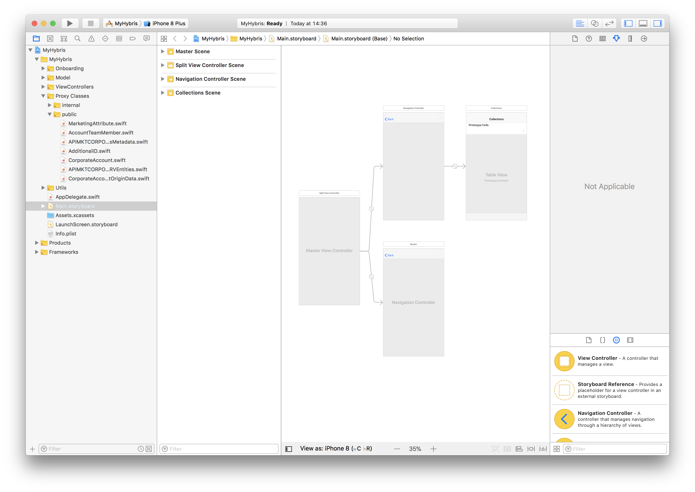

The `Main.storyboard` shows split-view setup for the generated Master-Detail views.

Folder `MyHybris/Onboarding` contains logic for the user on-boarding, authentication and handling of pass-codes and Touch ID.

Folder `Proxy Classes` contains the OData proxy classes generated from the OData service. File `APIMKTCORPORATEACCOUNTSRVEntities.swift` acts as a data service provider to gain access to the OData entities. The files `AccountTeamMember.swift`, `AdditionalID.swift`, `CorporateAccountOriginData.swift`, `CorporateAccount.swift` and `MarketingAttribute.swift` are proxy classes which give access to the various properties of the respective OData entities.

[ACCORDION-END]

[ACCORDION-BEGIN [Step 8: ](Build and run the generated application)]

Click the **Run** button to build and run the generated `MyHybris` application:


The **Simulator** app now launches. If you have configured the app to allow for push notifications, you will get the following pop-up:

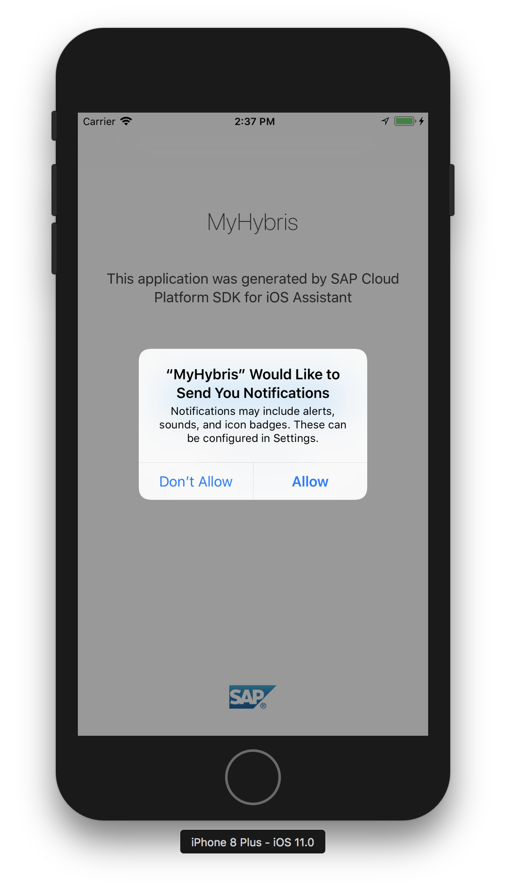

Press **Allow** and click the blue **Start** button.


The **SAML** login screen of **SAP Cloud Platform mobile service for development and operations** is shown. Enter your login credentials for the SAP Cloud Platform and press the **Log On** button:

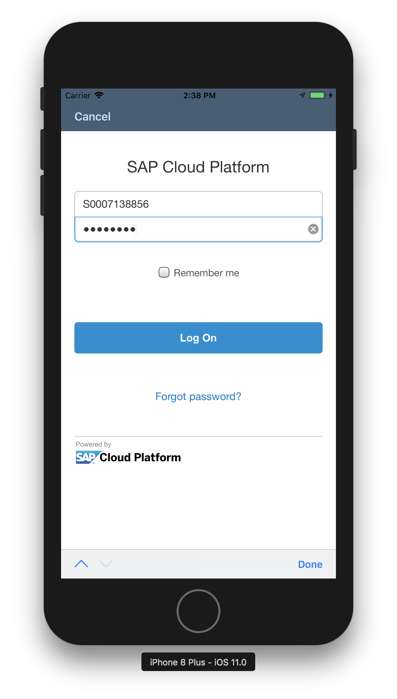

The app now gives you the option to enable Touch ID for quick access to your app. Since you are running from the simulator, you can click **Not Now**

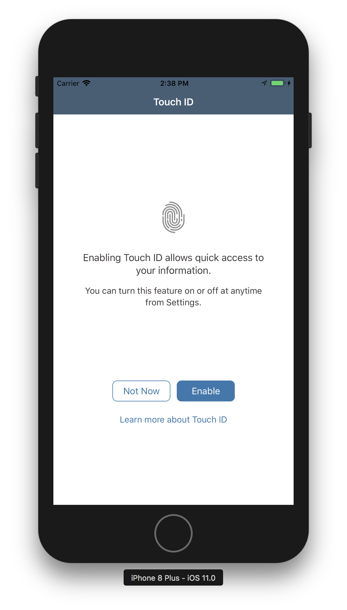

Now, you should provide a passcode with a minimum of 8 characters. Enter a numeric passcode:

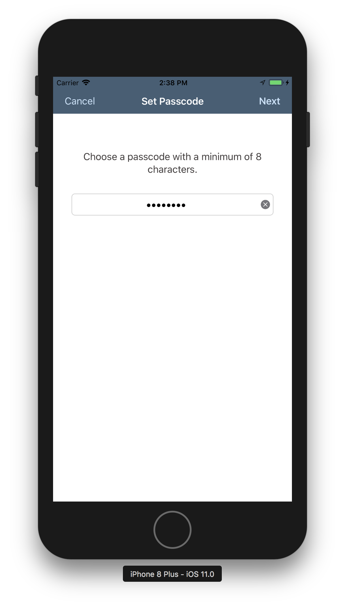

Click **Next**, confirm the passcode, and click **Done**.

The app starts with an overview of the available **Collections** of the OData service:

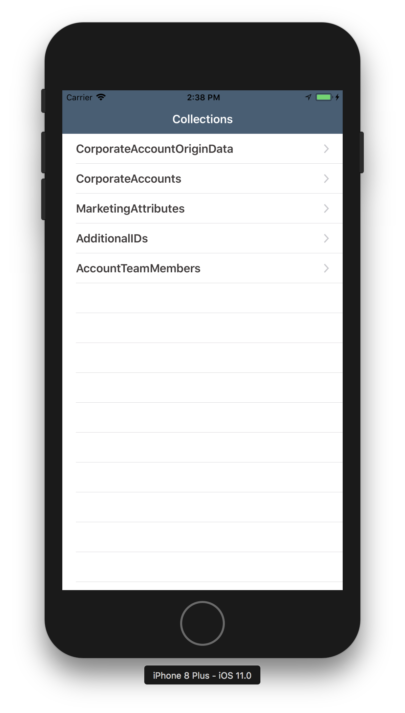

[ACCORDION-END]

[ACCORDION-BEGIN [Step 9: ](Examine the generated application)]

If you click on the `CorporateAccounts` collection, you navigate to a **Master** list with all available `CorporateAccount` entities:

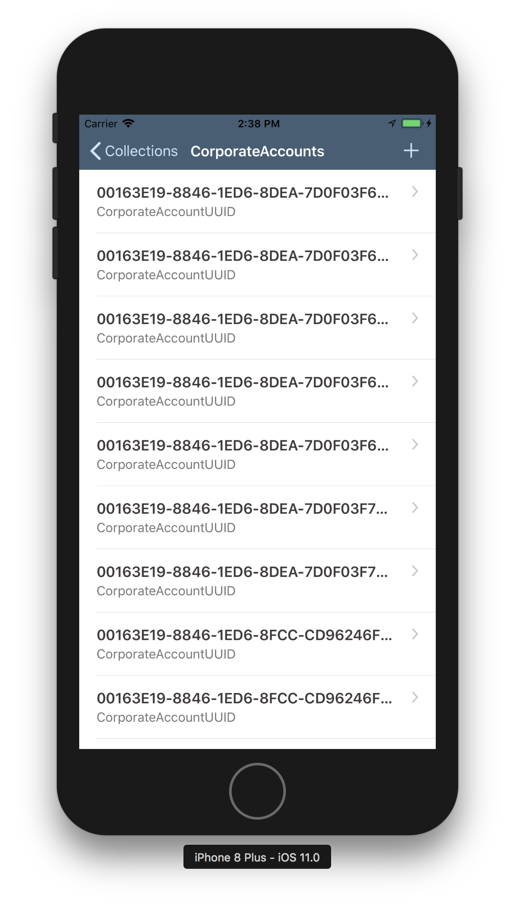

As you see, the list looks pretty awful with meaningless ID's. This will be corrected in the next steps.

If you click on one of the `CorporateAccount` entities, you navigate to a **Detail** page which lists all the properties for the selected entity:


[ACCORDION-END]

[ACCORDION-BEGIN [Step 10: ](Open the SAP Fiori for iOS Mentor app)]

Open the SAP Fiori for iOS Mentor app on your iPad. Upon opening, the app shows an overview page:

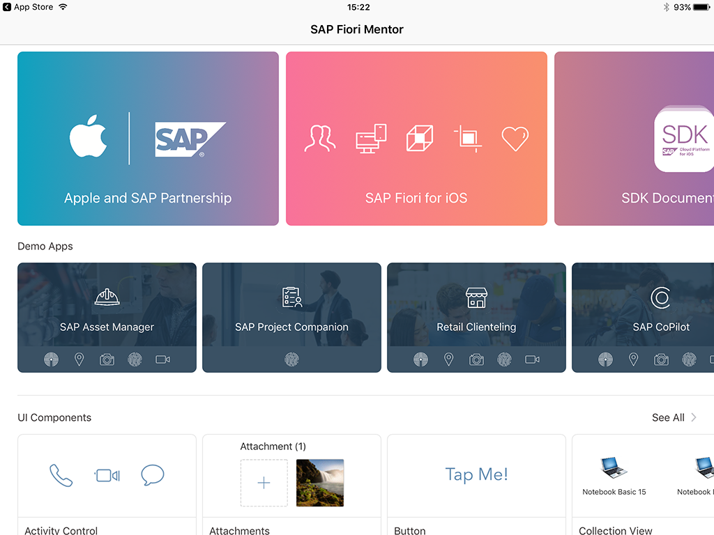


[ACCORDION-END]

[ACCORDION-BEGIN [Step 11: ](Locate the Contact Cell)]

Click on the **See All** link next to the **UI Components** section, and scroll down until you see the **Contact Cell** tile:

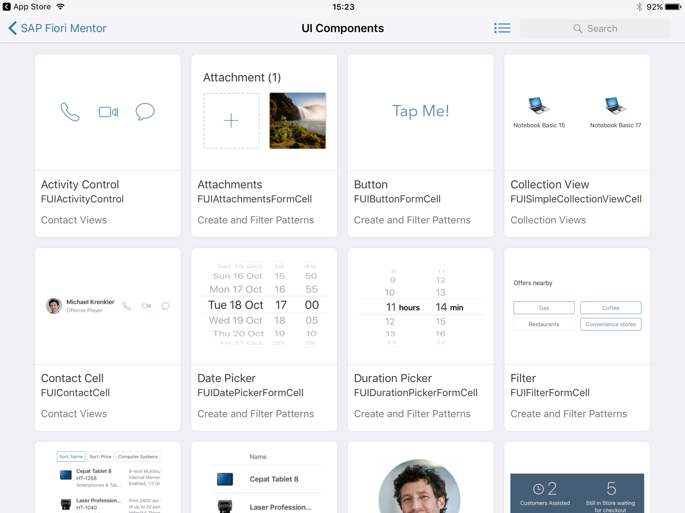


[ACCORDION-END]

[ACCORDION-BEGIN [Step 12: ](Examine the Contact Cell control)]

Click the **Contact Cell** tile. You now see a page wit a representation of the SAP Fiori Contact cell, and a couple of preset styles to change the look and feel for the control.

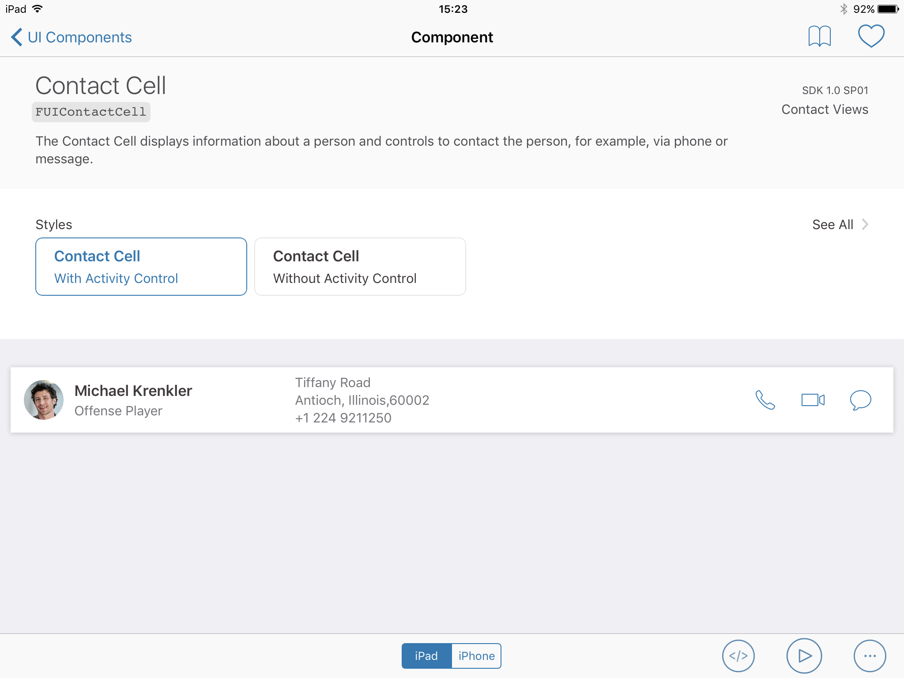

> You can also customize the look and feel on a more granular level. Click the **button with three dots** in the lower right corner. This will bring a pop up where you can specify different settings for the control. The control's look and feel is instantly updated, giving you an idea of the final result.


[ACCORDION-END]

[ACCORDION-BEGIN [Step 13: ](Display the generated code)]

When you're happy with the final result, click the **Code button** (the one labeled `</>`). This will bring a pop up with a sample `UITableViewController` class, and all the properties you have set or enabled in the **Control Settings** pop-up are reflected in the generated code:

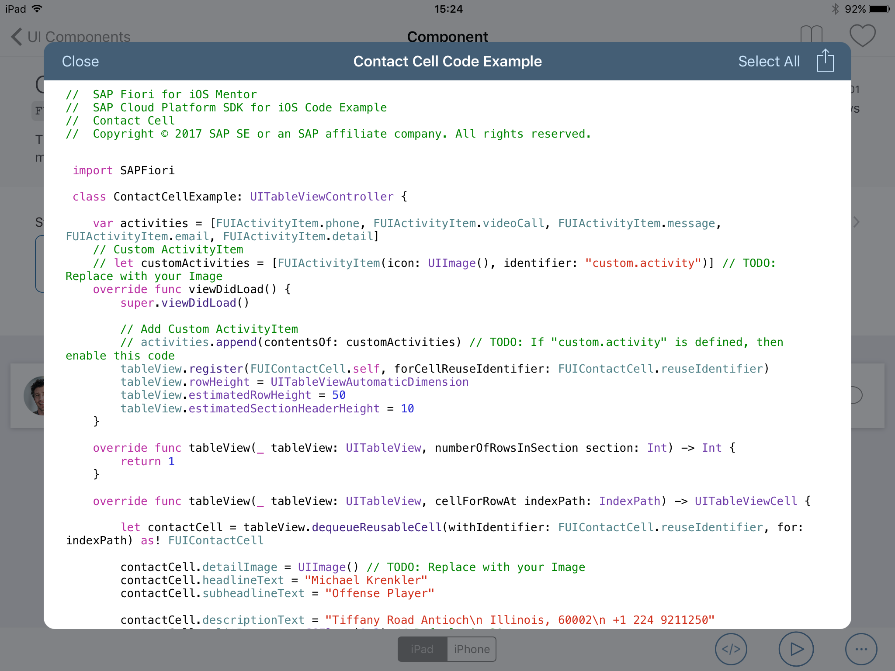


[ACCORDION-END]

[ACCORDION-BEGIN [Step 14: ](Export the generated code)]

To use the generated code in Xcode, click the **Share** button in the top-right, and use **AirDrop** to transfer to your Mac:

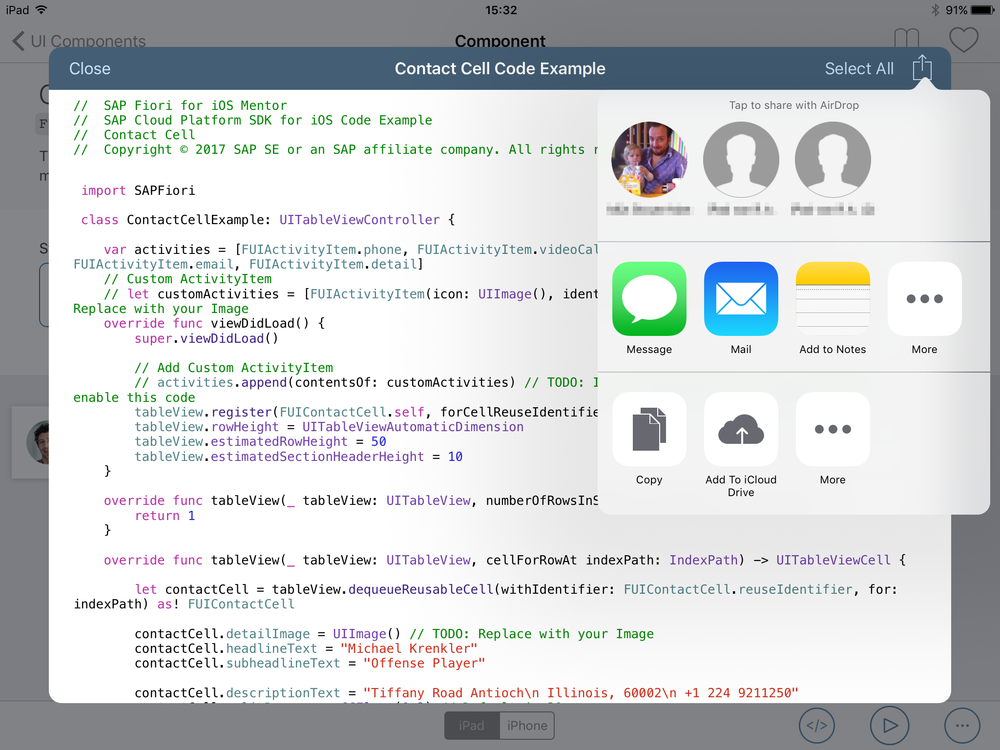

Open the downloaded text file:

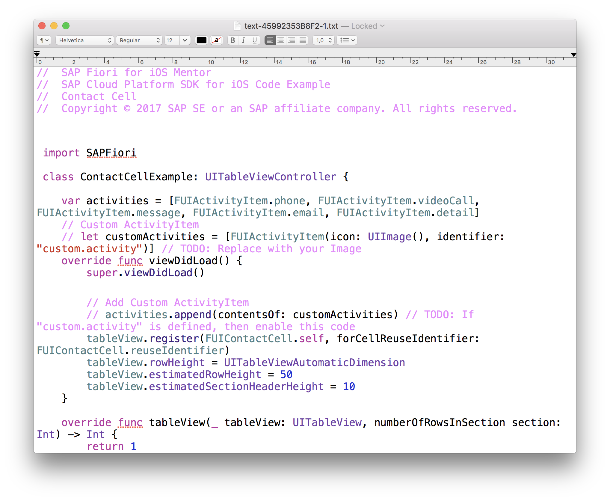

The generated code can now be implemented into the appropriate places in the `CorporateAccountsMasterViewController.swift` file.

>   **NOTE** Since it may take a bit too long to go through the steps of copying and pasting the code, adding the control binding to the Proxy Classes' properties and format the data properly, you don't need to do this yourself. The code to implement will be provided in the next steps.


[ACCORDION-END]

[ACCORDION-BEGIN [Step 15: ](Define Contact Cell Activities)]

Open file `CorporateAccountsMasterViewController.swift` in folder `MyHybris > ViewControllers > CorporateAccounts`.

First, you define the activities for the Contact Cell. The exported code in the previous step contains 5 activities, but we'll need just **Phone**, **SMS** and **Email**.

Add the following private field to class `CorporateAccountsMasterViewController`:

```swift
private var activities = [FUIActivityItem.phone, FUIActivityItem.message, FUIActivityItem.email]
```

[ACCORDION-END]

[ACCORDION-BEGIN [Step 16: ](Modify viewDidLoad method)]

Locate the `viewDidLoad()` method.

Add the following line:

```swift
self.tableView.register(FUIContactCell.self, forCellReuseIdentifier: FUIContactCell.reuseIdentifier)
```

In addition, change the line:

```swift
self.tableView.estimatedRowHeight = 98
```

to

```swift
self.tableView.estimatedRowHeight = 50
```

[ACCORDION-END]

[ACCORDION-BEGIN [Step 17: ](Render Contact Cell)]

Locate method `tableView(_:cellForRowAt:)`.

Replace the entire method with the following:

```swift
override func tableView(_ tableView: UITableView, cellForRowAt indexPath: IndexPath) -> UITableViewCell {
    let corporateaccount = self.entities[indexPath.row]

    let contactCell = tableView.dequeueReusableCell(withIdentifier: FUIContactCell.reuseIdentifier, for: indexPath) as! FUIContactCell

    // get URL from OData service, if available
    if let ciURLString = corporateaccount.interactionContactImageURL, !(corporateaccount.interactionContactImageURL?.isEmpty)! {
        let ciURL = URL(string: ciURLString)
        let data = try? Data(contentsOf: ciURL!)

        if let imageData = data {
            contactCell.detailImage = UIImage(data: imageData)
        }
    } else {
        contactCell.detailImage = UIImage() // TODO: Add your own default image
    }

    // Added data binding
    contactCell.headlineText = corporateaccount.fullName
    contactCell.subheadlineText = corporateaccount.regionName
    contactCell.descriptionText = "\(String(describing: corporateaccount.streetName)) \(String(describing: corporateaccount.addressHouseNumber))\n \(String(describing: corporateaccount.cityName))\n \(String(describing: corporateaccount.phoneNumber))"
    contactCell.splitPercent = CGFloat(0.3) // Default is 30%

    // Add activities from Step 15
    contactCell.activityControl.addActivities(activities)
    contactCell.activityControl.maxVisibleItems = 3

    // Perform activity
    contactCell.onActivitySelectedHandler = { activityItem in
        switch activityItem {
        case FUIActivityItem.phone:
            guard let number = URL(string: "tel://" + corporateaccount.phoneNumber!) else { return }
            if UIApplication.shared.canOpenURL(number) {
                UIApplication.shared.open(number)
            }
        case FUIActivityItem.message:
            guard let sms = URL(string: "sms:" + corporateaccount.phoneNumber!) else { return }
            if UIApplication.shared.canOpenURL(sms) {
                UIApplication.shared.open(sms)
            }
        case FUIActivityItem.email:
            guard let email = URL(string: "mailto:" + corporateaccount.emailAddress!) else { return }
            if UIApplication.shared.canOpenURL(email) {
                UIApplication.shared.open(email)
            }
        default: break
        }
    }

    return contactCell
}```

First, you get a reference to the current data via variable `corporateaccount`.

Then, a `FUIContactCell` is registered to the table.

Using the `corporateaccount` reference, you check whether an image is available for the current account. If it is available, it is then rendered to the `FUIContactCell`.

Then, some extra fields are bound to the control.

And finally, the activities defined in step 15 are added to the cell, and a handler is implemented for the activities.

[ACCORDION-END]

[ACCORDION-BEGIN [Step 18: ](Build and run the application)]

Build and run the application. Navigate to the `CorporateAccounts` master page. It is now rendered using the `FUIContactCell` control:


If you click on the activity buttons, the respective app should open.

> If you're running in the simulator, **Mail** and **Phone** apps are not available so nothing will happen. **Messages** app is available, but since it lacks a **New Message** button, it won't open a new message with the number pre-filled.

> If you're running on a physical device, everything should work as expected.

[ACCORDION-END]

---
